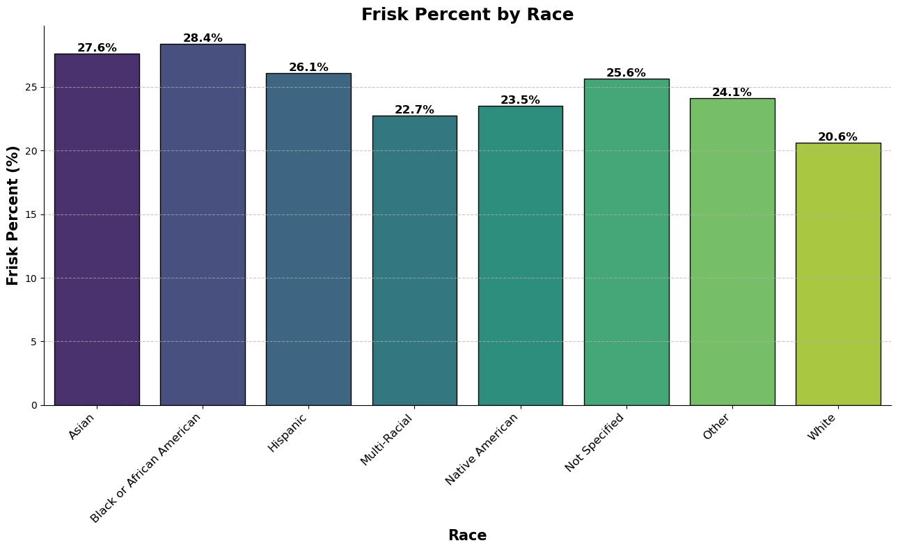

## Seattle Terry Stops Prediction Project
By: Shamla Tadese Araya
Moringa School
Aug 2024
***

## INTRODUCTION
In Seattle, Terry stops refer to brief stops and detentions by police officers based on a reasonable suspicion that a person may be involved in criminal activity. The term originates from the U.S. Supreme Court case Terry v. Ohio (1968), which established the legal standard for such stops. In Seattle, these stops are subject to both federal and local regulations, and there has been considerable debate over their impact on communities, particularly concerning concerns about racial profiling and civil liberties. Efforts to refine and improve the practice focus on balancing effective policing with the protection of individual rights.
In this project we aim to achieve the following objectives:
* Determine if there is a racial disparity in the Seattle Terry Stops
* Do the differences in races between the officer and the subject play a role in frisks arrests?
* Determine the most common outcome of the Seattle Terry Stops and what it means
* Develop a model that can accurately predict the likelihood of an arrest occurring during a Terry Stop

This project will be divided into three workbooks, each focusing on a specific aspect of the process. We will start by exploring the data and cleaning, followed by exploratory analysis aiming to addressing the first three objectives which are racial disparity during Terry Stops, role of race in the Terry Stops and the most common outcome of the Terry Stops in Seattle. We will then move on to the third workbook where we will be addressing the fourth objective of developing a comprehensive predictive model that can accurately predict the likelihood of an arrest following a Terry Stop based on various factors.
In this project we will be using the data obtained from City of Seattle on https://data.seattle.gov/Public-Safety/Terry-Stops.

### Part 1
## Observing the Data
The dataset on Terry stops from the City of Seattle's open data portal contains about 61000 entries with 23 columns which typically includes information on interactions between Seattle police officers and individuals during Terry stops. Here’s a general description of what this dataset contains:
Stop Date and Time: When the Terry stop occurred, including the specific date and time.
Location: The geographic location where the stop took place, often including neighborhood or precinct information.
Officer Details: Identifiers or information related to the officers who conducted the stop, though specific identifying details might be anonymized.
Demographic Information: Data on the individuals stopped, such as race, gender, and age. This helps in analyzing the demographic breakdown of those stopped.
Reason for Stop: The reason or suspicion that led to the stop, providing context for why the individual was stopped.
Outcome of the Stop: The result of the stop, such as whether a search was conducted, if an arrest was made, or if a citation was issued.
Search Details: Information on whether a search was conducted during the stop, and if so, what was found.
Interaction Type: Information on the nature of the interaction, such as whether it was a stop-and-frisk, a consent stop, or another type of encounter.
Agency and Division: Information about which division or unit within the police department conducted the stop.
The dataset aims to provide transparency and allow for analysis of police practices, helping to ensure accountability and evaluate the impact of Terry stops on different communities.

## Data Cleaning
Cleaning the dataset involved removing dashes, spaces, dropping unwanted columns, dealing with missing values, checking for duplicates and converting the date and time to pandas date time format.

# Feature Engineering
At this point we engineered some features like the 'same_race', 'same_gender' and so on.

## Exporting to CSV
Finishing cleaning, feature engineering and preprocessing the dataset, we then exported the final work as a clean csv file for EDA.

### Part 2
## Exploratory Data Analysis on Seattle Terry Stops
This is a continuation of the project we started by preprocessing. In this part we addressed the first three objectives.

## Yearly Terry Stops pattern covering the time period in the dataset
We look at the pattern of the Terry stops in Seattle for general overview.

The spike in Terry Stops in Seattle in 2018 was a direct response to the surge in gun violence in the city. The Seattle Police Department's decision to increase stop-and-frisk activities was part of a broader strategy to address public safety concerns and reduce violent crime.
The drastic fall in Terry Stops in Seattle from 2019 to 2021 can be attributed to a combination of factors, including increased scrutiny and accountability due to police reform measures, the impact of protests and calls for reform (following the George Floyd incident), changes in crime trends, legal and community challenges, and operational shifts influenced by the pandemic. These factors collectively contributed to a reduction in the number of Terry Stops conducted by law enforcement during this period.
While the drop in Terry stop instances between 2023 and 2024 could reflect successful reforms, shifts in policing strategy, or changes in crime trends, among other factors. Understanding the specific reasons for the decline is crucial for evaluating its significance and ensuring that policing practices align with broader goals of fairness and effectiveness.

## Relationship between Terry Stops and Subject's Race
Here try to see if there is any relationship between the Terry Stops and the Subject's Race. To do that we calculated the stop ratios for each race in the dataset in contrast to their respective population.

Race	                                 Population	                    Percentage (of total)

White	                                 467,390 = 	                          0.63

Asian	                                 123,703 = 	                          0.17

Two or more races	                     69,030 = 	                          0.09

Black or African American	             49,534 = 	                          0.07

Other race	                             19,235 = 	                          0.02

Native American	                         4,111 = 	                          0.005

Native Hawaiian or Pacific Islander	     1,600 = 	                          0.002 (This race is aggregated with the 'Other race' for better calculation which comes to 0.022)
This population data is available at https://worldpopulationreview.com/us-cities/washington/seattle

Ok so we see here that the highest stop ratio is for White with 49% and African American follows second with 30%. Even though the White is the dominant race in Seattle (63%), the proportion of the stop ratio vs the population is ok as is with all the other races except the Native Americans and the African Americans. With both these races the result is worrisome. Even though they are only 0.005% and 7% of the population respectively, the proportion of the stop ratio is 2.7% and 30%. This makes these races the most affected races by the Seattle Terry Stop.

## Frisk Data
Let us do the frisk flag test to see what happens.

As we can see it here as well the level of frisk instances between white and African American is almost parallel. Though the White race out numbers the African American race by a huge margin, the frisk instances are almost equal which can be an indication of the fact that there is a tendency towards racial bias.
The higher frequency of frisk instances among the African American community during Terry stops in Seattle may stem from several interconnected factors:
* Historical and Systemic Bias: Long-standing racial biases and historical inequalities can influence policing practices, leading to disproportionate scrutiny of Black individuals.
* Policing Practices: Law enforcement may focus more on neighborhoods with higher crime rates, which can disproportionately affect racial minorities if those areas have higher minority populations.
* Socioeconomic Factors: Economic disparities, which often correlate with race, can result in more frequent police encounters in economically disadvantaged areas.
* Perceptions and Data: Biases in crime perception and the ways data are recorded and interpreted can affect how often stops and frisks are conducted among different racial groups.

## Arrest Data
Let us further check what happens with the arrest instances.

This as well suggests the same fact. All the other races have almost 10% arrest instances out of the total stops they get while the African American race gets about 12% of arrest instances out of the total stops.

## Racial Relationship Data
Here we created 2 dataframes: One where officer and subject are of the same race and another where they are not.

There are more frisks and arrests among the same races, but fewer among different race. There could be a couple of reasons for this.  One is that an officer whose race is different is more hesitant and doesn't want to risk the possibility of their actions being considered racist.  Another explanation is that the officers in Seattle are assigned to beats where the local demographics match their own.

## Frisk to Arrest Data
Let us do a comparison between the number of frisks and the number of arrests.

It is interesting to see that there is a huge gap between the number of people frisked and the number of people arrested. This could sound like a faulty call by the officers frisking people without enough information which could mean violation of people's 4th amendment right. On the other hand it could mean a cautious approach by officers, focusing on immediate safety concerns without escalating to arrests unless justified. However, it's important to continuously review these practices to ensure they align with legal standards and community expectations.

## Terry Stop Common Outcome
Finally we tried to identify the common outcome of the stop resolutions.

The most common outcome of the Seattle Terry Stop resolution happens to be "Field Contact". While field contacts are generally less intrusive than formal stops, a high frequency should be assessed to ensure it aligns with the goals of the resolution, maintains community trust, and is in line with fair policing practices.
This result confirms that the numerous frisk instances are actually more of a preventive measures than violations of people's rights but extreme caution is necessary.

## Part 3
## Seattle Terry Stops Modeling
Alright this is the third part of the project. For a brief recap, we started with the preprocessing part where we loaded the Terry Stops csv data that we downloaded from the Seattle City official website. At this stage we observed, cleaned and preprocessed the data. We created a csv file with the cleaned data to be used for EDA. At the second part we used the cleaned data to do our exploratory analysis. We addressed a couple of problems and came up with recommendations we believe are going to resolve those problems.
At this third part we focused on modeling. The sole purpose of this stage is to:
* creating the best model that predicts the likelihood of an arrest during a Terry Stop

## One Hot Encoding
A lot of our data is non-numerical as a result we OneHotEncoded our features to be able to use them.
For this task we compared three different classification models with confusion matrix plot for each one and finally we dfined a function that identifies the best model.

1. ## The Logistic Regression Model

2. ## K-Nearest-Neighbors (KNN) Classifier
Determined the optimal k value for KNN classification and built and evaluated the KNN model using the optimal k value:

3. ## Decision Trees
Grid Search for Optimal Parameters
We begun by running a grid search to identify the optimal parameters for our decision tree model and used the best parameters identified from grid search to build and evaluate our decision tree model.

## Identifying the BEST MODEL
Finally we defined a function called evaluate_models() which takes our feature and target variables with 20% test size and random state of 42. The function returns the best model based on the highest F1 score. The reason we decided to use the F1 score as the final weighing parameter is because we have class imbalance.

Remarkably the Logistic Regression and the Decision Tree models did really well in predicting the outcomes of Terry stops, showcasing their potential for aiding law enforcement decision-making processes. Based on the outcome of the function we defined to identify the best model though we are concluding that the Decision Tree Model is the best performing one to be recommended.

## Conclusion
1. The fact that African Americans experience 30% of Terry stops despite being only 7% of the population suggests a significant racial disparity in policing. This indicates potential biases in police practices.
2. The data suggests that African Americans, while experiencing fewer overall Terry stops compared to White individuals, are subject to frisks more frequently when stopped. This disparity could indicate potential racial bias or differing police practices that result in more invasive procedures for African Americans. 
3. A large gap between the number of people frisked and the number of arrests can have negative impacts on individuals, community relations, and policing effectiveness. It may lead to perceptions of unfairness, reduced trust in law enforcement, and potential legal and ethical concerns. 
4. Officers exhibiting higher frisk and arrest frequencies towards individuals of their own race compared to those of a different race suggests potential issues related to racial bias or community-specific policing practices. This pattern might reflect familiarity bias, targeted enforcement, or implicit racial biases among officers.
5. The prevalence of "Field Contact" as the most common outcome of Terry stops in Seattle indicates that many stops do not result in formal legal action but rather involve brief interactions with individuals. This trend highlights the role of field contacts in proactive policing and community engagement, while also raising questions about effectiveness, resource allocation, and community perceptions.
6. **Best Model:** Based on the outcome of the function we defined to identify the best model though we are concluding that the Decision Tree Model is the best performing one to be recommended.

## Recommendations:
1. **Address Racial Bias:** Implement anti-bias training, revise stop policies for fairness, and increase transparency through audits and public reporting.
2. **Reform Frisk Practices:** Review frisk criteria to ensure they are justified and applied fairly, minimizing racial profiling.
3. **Evaluate Effectiveness:** Assess and adjust stop-and-frisk practices to improve outcomes and build community trust.
4. It is important to implement anti-bias training, review policing policies, and ensure equitable enforcement practices. Additionally, engaging with communities and improving data collection can help address and mitigate these disparities.
5. **Optimize Field Contacts:** Ensure field contacts are constructive and aligned with policing goals to enhance effectiveness and community engagement.
6. By analyzing and predicting Terry stops in Seattle, law enforcement officers and community members can make informed decisions about when and where to stop individuals, address the identified issues and concerns, and improve the overall effectiveness of their policing efforts.

